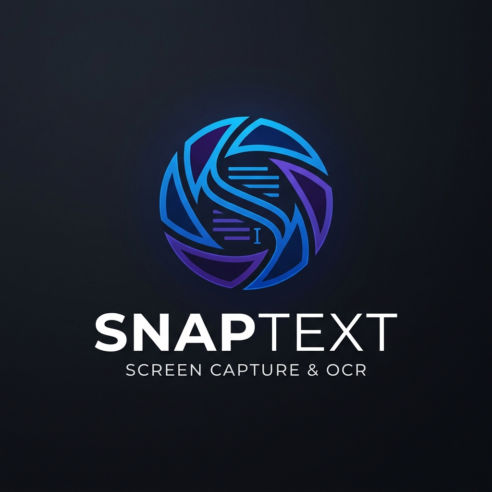

# SnapText V3 - Modern OCR Tool

<p align="center">
  
</p>

**SnapText**, Windows platformu için geliştirilmiş, yüksek performanslı ve modern bir ekran metni okuma (OCR) aracıdır. Ekranın herhangi bir bölgesinden tek tıkla metin çıkarmanıza ve panoya kopyalamanıza olanak tanır.

## 🚀 Özellikler

- **Hassas OCR:** Gelişmiş algoritmalar ile ekran görüntülerinden metni saniyeler içinde çıkarır.
- **Modern UI:** Material Design prensipleriyle tasarlanmış, karanlık mod uyumlu ve estetik kullanıcı arayüzü.
- **Otomatik Kopyalama:** Metin algılandığı anda otomatik olarak panoya kopyalanır.
- **OCR Geçmişi:** Daha önce taranan metinleri tarihçede saklar ve hızlı erişim sağlar.
- **Ayarlar Menüsü:**
  - Her zaman üstte kalma modu.
  - Dil seçimi (Türkçe, İngilizce).
  - Otomatik kopyalama açma/kapatma.
- **DPI Uyumluluğu:** Yüksek çözünürlüklü ve farklı ölçeklendirilmiş monitörlerde sorunsuz çalışma.

## 🛠 Kullanılan Teknolojiler

- **Dil:** C# (.NET 9)
- **Framework:** WPF (Windows Presentation Foundation)
- **UI Kütüphanesi:** [Material Design in XAML Toolkit](https://github.com/MaterialDesignInXAML/MaterialDesignInXamlToolkit)
- **OCR Engine:** Windows Media OCR API

## 📋 Nasıl Kullanılır?

1. Uygulamayı çalıştırın.
2. Ana penceredeki **"EKRANDAN YAZI ÇIKAR"** butonuna tıklayın.
3. Ekran karardığında, okumak istediğiniz alanı fare ile seçin.
4. Çıkarılan metin ana pencerede görünecek ve (ayarlanmışsa) otomatik olarak kopyalanacaktır.

## 📦 Kurulum ve Çalıştırma

Projeyi yerelinizde çalıştırmak için:

```powershell
# Depoyu klonlayın
git clone https://github.com/projectfkali/snaptext.git

# Proje dizinine gidin
cd snaptext

# Uygulamayı çalıştırın
dotnet run
```

---
Geliştiren: **projectfkali**
